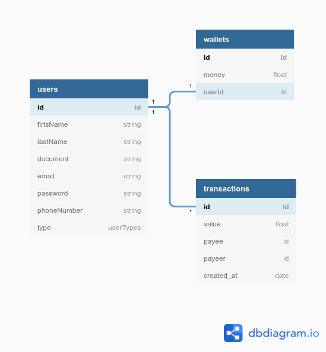

# My Bank :moneybag:

Api RESTFULL em lumen que simula uma transação bancária entre dois usuários.

## Regras
- Um usuário do tipo COMMON poderá realizar transações para outro usuário do tipo COMMON ou para um SHOPKEEPER
- Um SHOPKEEPER não pode realizar transações, apenas receber

## Requisitos 
- php 7.*
- mysql 
- insomnia ou postman

## Como rodar

 - Realize clone do projeto na sua máquina
 - Crie o banco de dados com o nome my_bank 
    ### Na raiz do projeto: 
    - Copie o arquivo .env.example e renomeie-o para .env
    - Execute `sh ini.sh` para inicializar o projeto
 - Execute o comando `docker exec -it php.mybank.dev php artisan queue:work` para monitorar os envios de notificações que serão enviados para a fila

## Rotas

- POST - `/transaction `
   - `  { 
            payer: int 
            payee: int
            value: float
        }    
    `
    - Cria uma transação 

- GET - `/user/{userId}/wallet`
    - Retorna userId com a sua carteira

## Diagrama de dados

